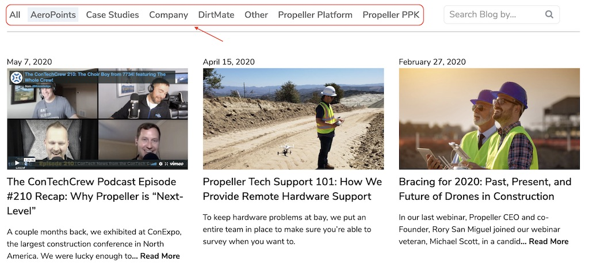

# Blog Scraper

This code base is a simple Blog Scraper written in JavaScript.

The goal here is to visit all the blogs from [Propelleraero](https://www.propelleraero.com)'s website and return a result of which blog has the highest word count.

There're several different strategies/paths to achieve the goal.

Approach 1:

From blog page visit all blogs in current page, as it only display 9 articles initially, so I have to click "More articles" then visit another 9 blogs then "More articles" then visit more blogs until no more blogs loaded. This would satisfy our goal but it's a little bit time consuming. That's why I'm going to follow approach 2.

Approach 2:

One thing I've noticed is, from blog page, click every blog header (other than "All") then it will display all blogs under this category, so what we need to do is to simply click all blog header buttons in order to get all blogs info, then we do the same thing, visit every blog page, this will save many page interactions.

Improvements:

One thing can be improved here is to visit multiple blogs at same time, this can huge amount of time.

# Prerequisites

-  [Node.js](https://nodejs.org/en/)
-  [Puppeteer](https://github.com/puppeteer/puppeteer)

# Install

    npm install

# Usage

    npm start

